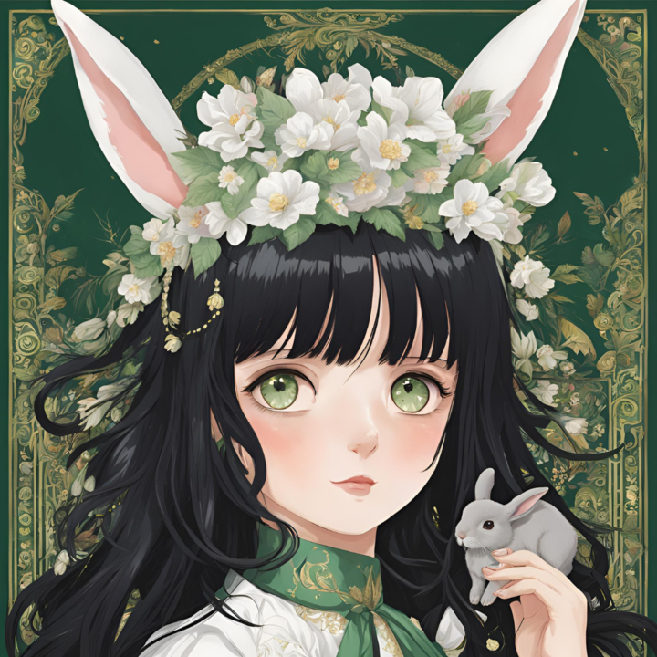

## 🌟 Hello, I'm AIRI 🌟
<!--

-->
## 👋 About Me
<!--
- 🏢 I work in the IT sector, focusing on AI research and development.
- 💻 Passionate about image recognition technology and AI-driven solutions.
- 🚀 Currently working on PoCs and transitioning them into full-fledged services.
- 📚 Dedicated to training new team members and enhancing their technical skills.
- 🍬 Food lover – especially gummies and spicy foods!
- ☕ Coffee enthusiast with a love for exploring different blends.
-->
## 🔧 Skills & Tools
<!--
- **Languages:** Python, JavaScript, TypeScript
- **Frameworks:** TensorFlow, PyTorch, React
- **Tools:** Docker, Kubernetes, GitHub Actions
-->
## 📈 GitHub Stats
<!--

-->
## 💬 Let's Connect
<!--
- [LinkedIn](https://www.linkedin.com/in/your-profile)
- [Twitter](https://twitter.com/your-profile)
- [Website](https://your-website.com)
-->
## 🌈 Fun Fact
<!--
I once tried to create a custom gummy bear flavor based on my favorite coffee blend! ☕🍬
-->
---

✨ Thanks for visiting my profile! Feel free to reach out if you have any questions or just want to chat. ✨

